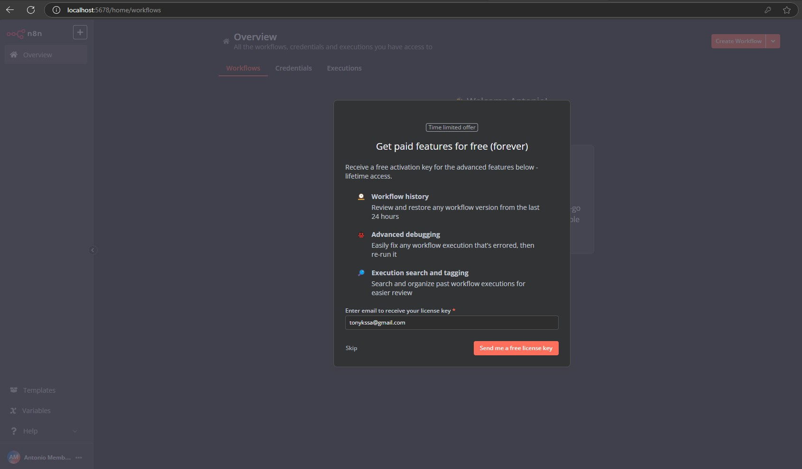
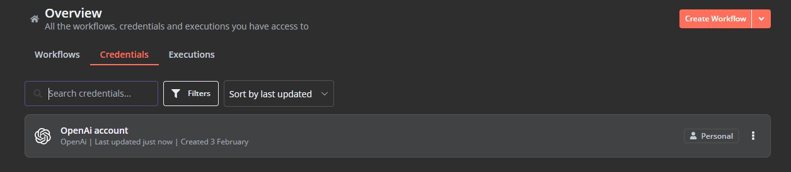
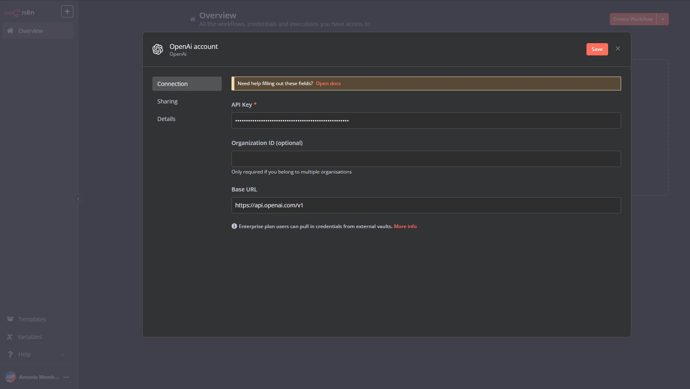
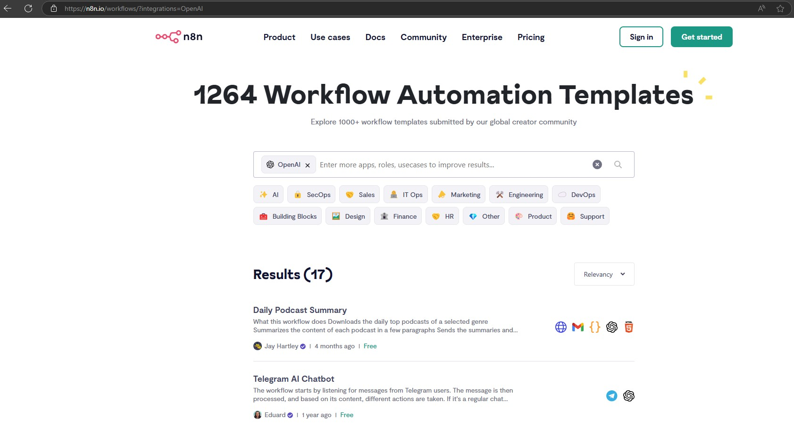

## N8N

### What's an agent in AI?#
One way to think of an agent is as a chain that knows how to make decisions. Where a chain follows a predetermined sequence of calls to different AI components, an agent uses a language model to determine which actions to take.

Agents are the part of AI that act as decision-makers. They can interact with other agents and tools. When you send a query to an agent, it tries to choose the best tools to use to answer. Agents adapt to your specific queries, as well as the prompts that configure their behavior.

### Agents in n8n#
n8n provides one Agent node, which can act as different types of agent depending on the settings you choose. Refer to the Agent node documentation for details on the available agent types.

When execute a workflow containing an agent, the agent runs multiple times. For example, it may do an initial setup, followed by a run to call a tool, then another run to evaluate the tool response and respond to the user.

## Install 
From NPM: 
```shell
npm install n8n -g
# or: n8n

n8n start
```

From Docker: 
```shell
docker run -it --rm \
  --name n8n \
  -p 5678:5678 \
  -v ~/.n8n:/home/node/.n8n \
  docker.n8n.io/n8nio/n8n
```

## Integration 

HTML:
```html
<link href="https://cdn.jsdelivr.net/npm/@n8n/chat/dist/style.css" rel="stylesheet" />
<script type="module">
	import { createChat } from 'https://cdn.jsdelivr.net/npm/@n8n/chat/dist/chat.bundle.es.js';

	createChat({
		webhookUrl: 'YOUR_PRODUCTION_WEBHOOK_URL'
	});
</script>
```

React:
```jsx
import { useEffect } from 'react';
import '@n8n/chat/style.css';
import { createChat } from '@n8n/chat';

export const App = () => {
	useEffect(() => {
		createChat({
			webhookUrl: 'YOUR_PRODUCTION_WEBHOOK_URL'
		});
	}, []);

	return (<div></div>);
};
```

## Run 
- docker-compose up
- [LocalHost: N8N](http://localhost:5678)
- [LocalHost: Prometheus](http://localhost:9090) 









## References
- [NPM N8N](https://www.npmjs.com/package/n8n)
- [GitHub N8N](https://github.com/n8n-io/n8n)
- [Templates](./doc/templates.md)
- [Workflows](./doc/templates.md)
- [Templates List](https://n8n.io/workflows/?integrations=OpenAI)
- [Docker Installation](https://docs.n8n.io/hosting/installation/docker/)
- [Task runners#](https://docs.n8n.io/hosting/configuration/task-runners/)
- [LangChain concepts in n8n](https://docs.n8n.io/advanced-ai/langchain/langchain-n8n/)
- [Call an API to fetch data](https://docs.n8n.io/advanced-ai/examples/api-workflow-tool/)
- [Built-in integrations](https://docs.n8n.io/integrations/builtin/node-types/)
- [Building community nodes](https://docs.n8n.io/integrations/community-nodes/build-community-nodes/)
    - [Build a node](https://docs.n8n.io/integrations/creating-nodes/build/)
    - [Build a declarative-style node#](https://docs.n8n.io/integrations/creating-nodes/build/declarative-style-node/)