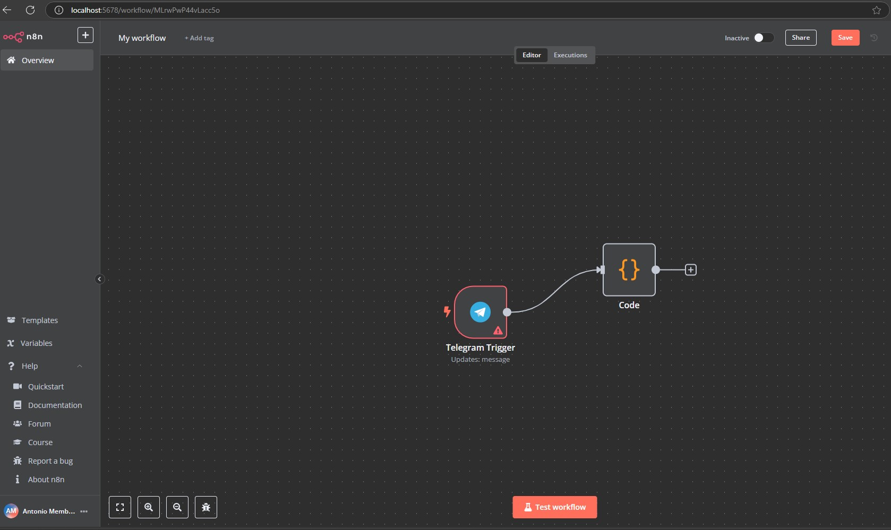

## References
- [Templates](./templates.md)
- [Workflows](https://n8n.io/workflows/?integrations=OpenAI)

### Example: 

```json
{
  "name": "My workflow",
  "nodes": [
    {
      "parameters": {
        "updates": [
          "message"
        ],
        "additionalFields": {}
      },
      "type": "n8n-nodes-base.telegramTrigger",
      "typeVersion": 1.1,
      "position": [
        -640,
        -240
      ],
      "id": "5a0db91f-4e07-4831-8f79-d710c49da6ae",
      "name": "Telegram Trigger",
      "webhookId": "2c12fd4f-9603-4d75-8a3f-a55a2967bb3c"
    },
    {
      "parameters": {
        "jsCode": "// Loop over input items and add a new field called 'myNewField' to the JSON of each one\nfor (const item of $input.all()) {\n  item.json.myNewField = 1;\n}\n\nreturn $input.all();"
      },
      "type": "n8n-nodes-base.code",
      "typeVersion": 2,
      "position": [
        -360,
        -320
      ],
      "id": "98619db7-a6c9-4c35-99eb-97c5047bfaa7",
      "name": "Code"
    }
  ],
  "pinData": {},
  "connections": {
    "Telegram Trigger": {
      "main": [
        [
          {
            "node": "Code",
            "type": "main",
            "index": 0
          }
        ]
      ]
    }
  },
  "active": false,
  "settings": {
    "executionOrder": "v1"
  },
  "versionId": "d59158cb-df9a-4c07-9122-e5d136199070",
  "meta": {
    "instanceId": "aa785d7e51ab1cc73f29aba1f38891651cd1839365f1687e2c1735800d3fca75"
  },
  "id": "MLrwPwP44vLacc5o",
  "tags": []
}
```