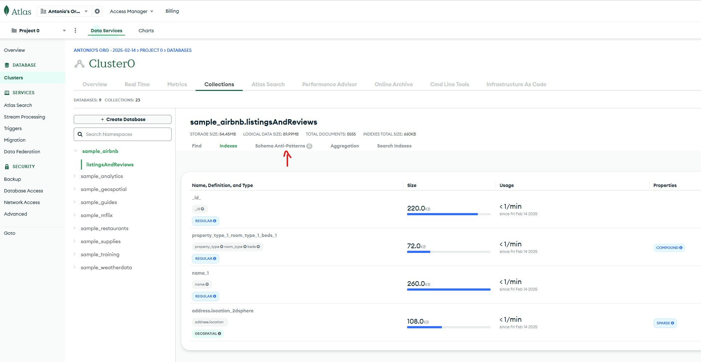
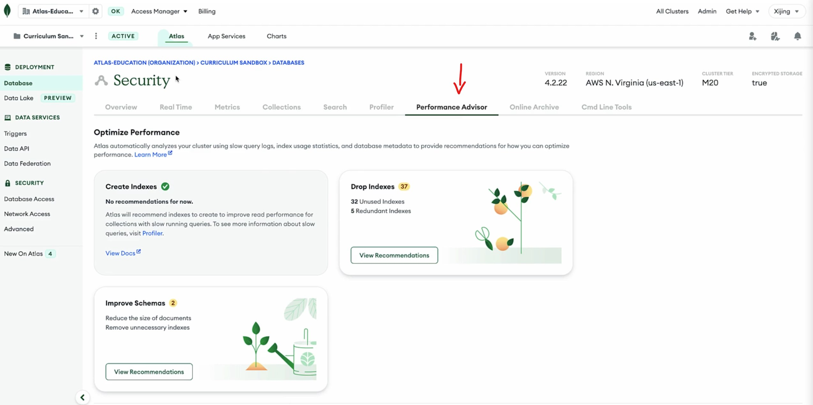

## Docs 

```js
db.help()
```

### Data
- JSON
- BJSON: 
    - Optimized for storage, retrieval, and transition across the wire
    - it is more sure than plain text JSON
    - it includes more data types

### Atlas
The MongoDB database is a core element of MongoDB Atlas, which is a multi-cloud developer data platform. The MongoDB database is the foundation of MongoDB Atlas. The additional functionality that Atlas offers—such as full-text search, data visualization, data lake storage, and mobile device sync—are built on top of data stored in cloud-hosted MongoDB database deployments.

### Data Modeling
- Embedded documents store related data in a single document.
- Reference relationships store data by linking references in one document to another document

### MongoDB's principle for how design data model:
Data that is accessed together should be stored together. How you model your data depends entirely on your particular application's data access patterns. You want to structure your data to match the ways that your application queries and updates it.

### Common schema anti-patterns
- Massive arrays
- Massive number of collections 
- Bloated documents 
- Unnecessary indexes
- Query without indexes
- Data that's accessed together, but stored in different collections 

### Tools 
- Atlas 
    - Data Explorer: The Schema Anti-Patterns tab highlights any issues in the collection and provides details to resolve them. You can improve your schema by resolving the anti-patterns that are shown.
    
    - Performance Advisor
    

### Connection String
- Examples:
    - Connect with the MongoDB Shell: `mongosh "mongodb+srv://mdb-training-cluster.swnn5.mongodb.net/myFirstDatabase" --apiVersion 1 --username MDBUser`
    - Connect your application: `mongodb+srv://MDBUser:<password>@mdb-training-cluster.swnn5.mongodb.net/myFirstDatabase?retryWrites=true&w=majority`
    - Connect using MongoDB Compass: `mongodb+srv://MDBUser:<password>@mdb-training-cluster.swnn5.mongodb.net/test`

### Topics
- [General Database Comparison](./comparison.md)
- [Security Database Comparison](./security/comparison.security.md)
- [CRUD & data manipulation](./crud.md)
- [Storage Engine & Cache](./features/Wired.Tiger.md)
- [Aggregations](./agregation.md)
- [Transactions](./transactions.md)
- [Indexes](./indexes.md)
- [Schema](./schema.md)
- [Authentication & Authorization](./security/auth.md)
- [Encyption](./security/encryption.md)
    - [CSE Encyption](./security/encryption.cse.md)
    - [CSFLE Encyption](./security/encryption.csfle.md)
    - [Queryable Encyption](./security/encryption.queryable.md)
- [Triggers](./triggers.md)
- [Scaling](./scaling.md)
- [AI & Vector Search](./ai.md)
- CIDR notation: CIDR notation represents an IP address and a suffix that indicates network identifier bits in a specified format. For example, you could express 192.168. 1.0 with a 22-bit network identifier as 192.168. 1.0/22.

## References 
- [Learners journey](https://learn.mongodb.com/pages/learners-journey)
- [Usage examples](https://www.mongodb.com/docs/drivers/node/current/usage-examples/)
- [Drivers](https://www.mongodb.com/docs/drivers/)
- [Introduction to MongoDB Data Modeling](https://learn.mongodb.com/learn/course/introduction-to-mongodb-data-modeling/conclusion/learn?client=customer&page=2)
    - [Model One-to-Many Relationships with Document References](https://www.mongodb.com/docs/manual/tutorial/model-referenced-one-to-many-relationships-between-documents/?_ga=2.64006886.810066485.1665291537-836515500.1666025886)
- [Deploy a Free Cluster](https://www.mongodb.com/docs/atlas/tutorial/deploy-free-tier-cluster/?utm_source=Iterable&utm_medium=email&utm_campaign=campaign_7715097)
- Security
    - [Technical and Organizational Security Measures](https://www.mongodb.com/legal/customer-service-agreement/technical-and-organizational-security-measures)
    - [MongoDB Security Bulletins](https://www.mongodb.com/resources/products/mongodb-security-bulletins)
    - [Authentication Mechanism (SCRAM)](https://www.mongodb.com/docs/manual/core/security-scram/)
    - [Atlas Administration API Authentication](https://www.mongodb.com/docs/atlas/api/api-authentication/)
    - [The Federal Information Processing Standard (FIPS)](https://www.mongodb.com/docs/manual/tutorial/configure-fips/#std-label-fips-overview)
    - [Implement Field Level Redaction](https://www.mongodb.com/docs/manual/tutorial/implement-field-level-redaction/)

## Links
- [Scale your startup from ideation to growth](https://www.mongodb.com/solutions/startups)
- Demos
    - [Spring IO Demos](https://sites.google.com/mongodb.com/springio-mongodb/home)
    - [SAT Demo: Azure Spring Service](https://github.com/mongodb-industry-solutions/sat-azure-spring-demo)
    - [Spring Data Unlocked - Series](https://github.com/mongodb-developer/spring-data-unlocked)
    - [Celebrity Lookalike!](https://mongodb-celeb-search.com/)
    - [Industry Solutions Demos](https://demo-portal.industrysolutions.prod.corp.mongodb.com/)
- AI
    - [Announcing the MongoDB MCP Server](https://www.mongodb.com/blog/post/announcing-mongodb-mcp-server)
    - [Atlas Vector Search Overview](https://www.mongodb.com/docs/atlas/atlas-vector-search/vector-search-overview/)
    - [Binary Quantization & Rescoring: 96% Less Memory, Faster Search](https://www.mongodb.com/blog/post/binary-quantization-rescoring-96-less-memory-faster-search)
- Security
    - [Client-Side Field Level Encryption](https://www.mongodb.com/docs/manual/core/csfle/)
        - [Use Automatic Client-Side Field Level Encryption with AWS](https://www.mongodb.com/docs/manual/core/csfle/tutorials/aws/aws-automatic/)
    - [Queryable Encryption Quick Start](https://www.mongodb.com/docs/manual/core/queryable-encryption/quick-start/)
    - [Encryption at Rest](https://www.mongodb.com/docs/manual/core/security-encryption-at-rest/)
    - [Authentication on Self-Managed Deployments](https://www.mongodb.com/docs/manual/core/authentication/)
- Monitoring
    - [Change Streams](https://www.mongodb.com/docs/manual/changeStreams/)
- Operations
    - [Aggregations](https://www.mongodb.com/docs/manual/aggregation/)
    - [Transactions](https://www.mongodb.com/docs/manual/core/transactions/)
    - [Apply Design Patterns](https://www.mongodb.com/docs/manual/data-modeling/schema-design-process/apply-patterns/)
    - [Building with Patterns: A Summary](https://www.mongodb.com/blog/post/building-with-patterns-a-summary)
    - [Time Series Data](https://www.mongodb.com/docs/manual/core/timeseries/timeseries-bucketing/)
- DevOps
    - [Ops Manager Architecture](https://www.mongodb.com/docs/ops-manager/current/core/system-overview/)
    - [Get Started with the Atlas Administration API](https://www.mongodb.com/docs/atlas/configure-api-access/)
    - [Back Up, Restore, and Archive Data](https://www.mongodb.com/docs/atlas/backup-restore-cluster/)
    - [Scaling / Sharding](https://www.mongodb.com/docs/manual/sharding/)