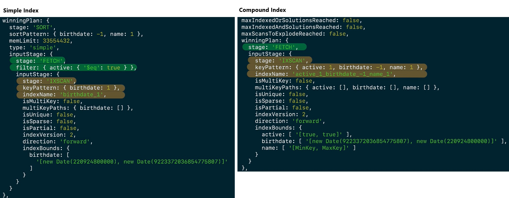

## Introduction 
- Indexes are data structures that improve performance, support efficient equality matches and range-based query operations, and can return sorted results.

- Indexes are used to make querying faster for users. One of the easiest ways to improve the performance of a slow query is create indexes on the data that is used most often.

- Indexes improve query performance at the cost of write performance.

### Types
- **Compound index**: MongoDB supports compound indexes, where a single index structure holds references to multiple fields within a collection's documents. A compound index is created by specifying the fields that the index should reference, followed by the order in which the fields should be sorted. The order of the fields in the index is important because it determines the order in which the documents are returned when querying the collection. A compound index can also be a multikey index if one of the fields is an array. 
    - A compound index is an index that contains references to multiple fields within a document. Compound indexes are created by adding a comma-separated list of fields and their corresponding sort order to the index definition.

- **Single field index**: A single field index is an index on a single field of a document. MongoDB creates a single field index on the _id field by default, but additional indexes may be needed for other fields as well. A single field index can also be a multikey index if it operates on an array field.

- **Multikey index**: A multikey index is an index on an array field. Each element in the array gets an index key, which supports efficient querying against array fields. Both single field and compound indexes can have an array field, so there are both multikey single field indexes and multikey compound indexes. In a compound index, only one field can be an array per index.

### Create a Single Field Index
Add {unique:true} as a second, optional, parameter in createIndex() to force uniqueness in the index field values. Once the unique index is created, any inserts or updates including duplicated values in the collection for the index field/s will fail.
```js
db.customers.createIndex(
    { email: 1 },
    { unique:true }
)
```

### View the Indexes used in a Collection
```js
db.customers.getIndexes()
```

### Check if an index is being used on a query
This plan provides the details of the execution stages:
- The `IXSCAN` stage indicates the query is using an index and what index is being selected.
- The `COLLSCAN` stage indicates a collection scan is perform, not using any indexes.
- The `FETCH` stage indicates documents are being read from the collection.
- The `SORT` stage indicates documents are being sorted in memory.
```js
db.customers
    .explain()
    .find({
        birthdate: {
            $gt:ISODate("1995-08-01")
        }
    })
    .sort({ email:1 })
```

What would happen if you attempt to insert a new document with an email that already exists in the collection? 
- MongoDB will return a duplicate key error, and the document will not be inserted. Unique indexes ensure that indexed fields do not store duplicate values. In this example, MongoDB will return a duplicate key error if you attempt to insert a new document with an email that already exists in the collection, as the unique constraint was set to true. 

### Multikey Indexes


### Create a Compound Index
```js
db.customers.createIndex({
  active:1, 
  birthdate:-1,
  name:1
})
```

### Order of Fields in a Compound Index
The order of the fields matters when creating the index and the sort order. It is recommended to list the fields in the following order: Equality, Sort, and Range.
- Equality: field/s that matches on a single field value in a query
- Sort: field/s that orders the results by in a query
- Range: field/s that the query filter in a range of valid values
The following query includes an equality match on the active field, a sort on birthday (descending) and name (ascending), and a range query on birthday too.
```js
db.customers
    .find({
        birthdate: {
            $gte:ISODate("1977-01-01")
        },
        active:true
    })
    .sort({
        birthdate:-1, 
        name:1
    })
```
Here's an example of an efficient index for this query:
```js
db.customers.createIndex({
  active:1, 
  birthdate:-1,
  name:1
})
```
Optimized queries use the first field in the index, Equality, to determine which documents match the query. The second field in the index, Sort, is used to determine the order of the documents. The third field, Range, is used to determine which documents to include in the result set.

### Deleting Indexes
The performance of the query will be negatively affected by the deletion of the only index that is currently supporting that query. Indexes generally improve the performance and time efficiency of queries by reducing the number of times that the database needs to be accessed. 

```js
db.customers.dropIndex('active_1_birthdate_-1_name_1')
```

The `hideIndex()` command hides an index. By hiding an index, you'll be able to assess the impact of removing the index on query performance. MongoDB does not use hidden indexes in queries but continues to update their keys. This allows you to assess if removing the index affects the query performance and unhide the index if needed. Unhiding an index is faster than recreating it. In this example, you would use the command:
```js
db.customers.hideIndex({email:1}).
```

Delete a list of indexes
```js
db.collection.dropIndexes([
  'index1name', 'index2name', 'index3name'
])
```

Delete all Indexes
```js
db.customers.dropIndexes()
```

## References 
- [Creating a Single Field Index](https://learn.mongodb.com/learn/course/mongodb-indexes/lesson-2-creating-a-single-field-index-in-mongodb/learn?client=customer&page=2)
- [Working with Compound Indexes](https://learn.mongodb.com/learn/course/mongodb-indexes/lesson-4-working-with-compound-indexes-in-mongodb/learn?client=customer&page=2)