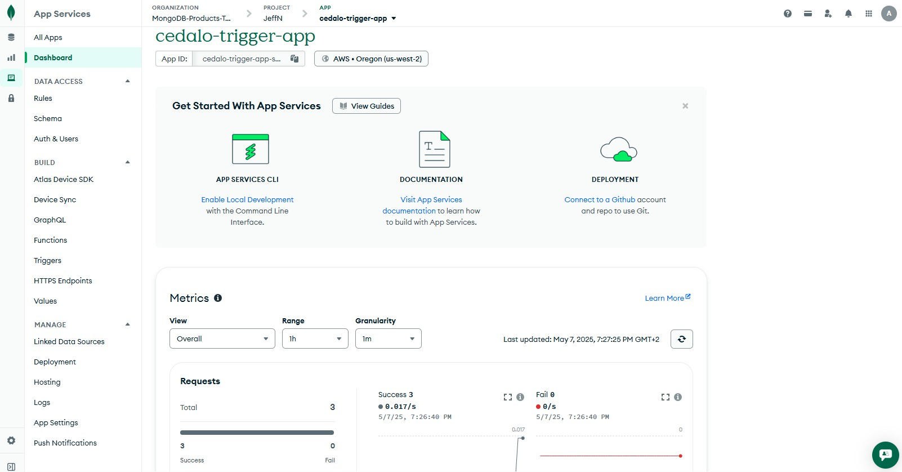
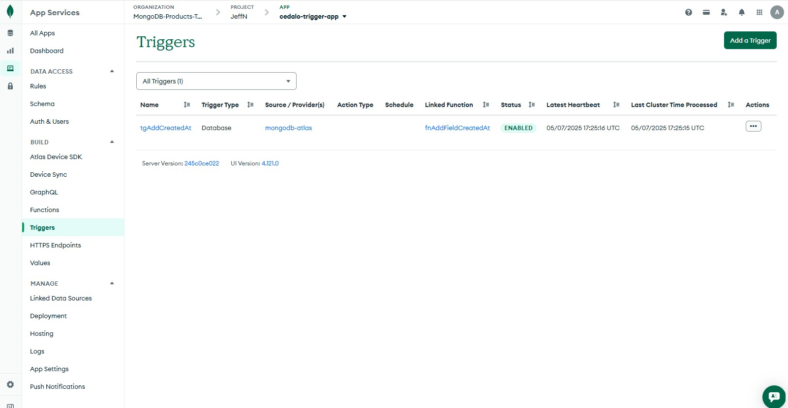
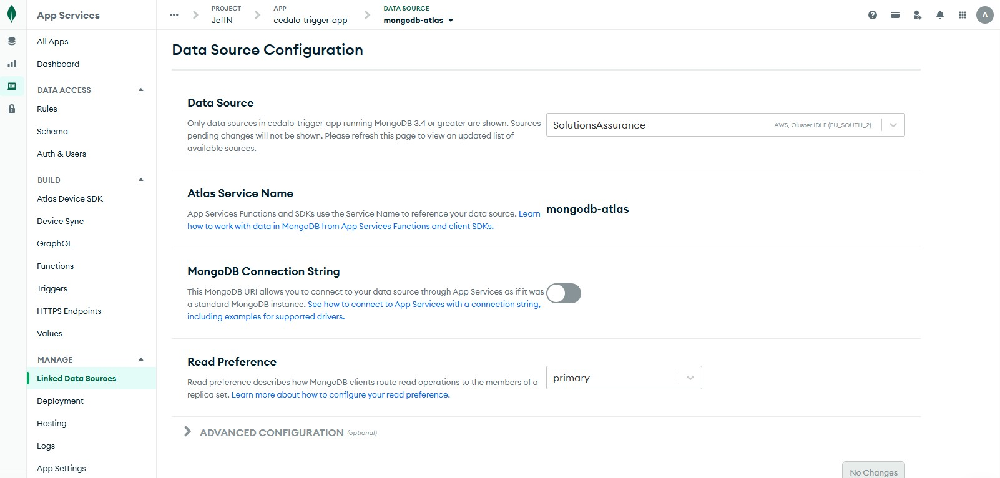
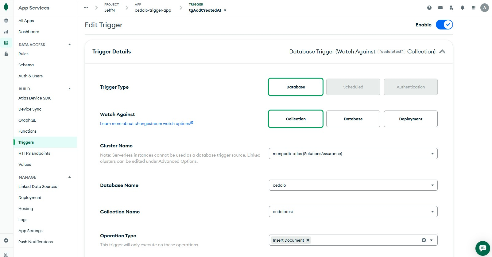
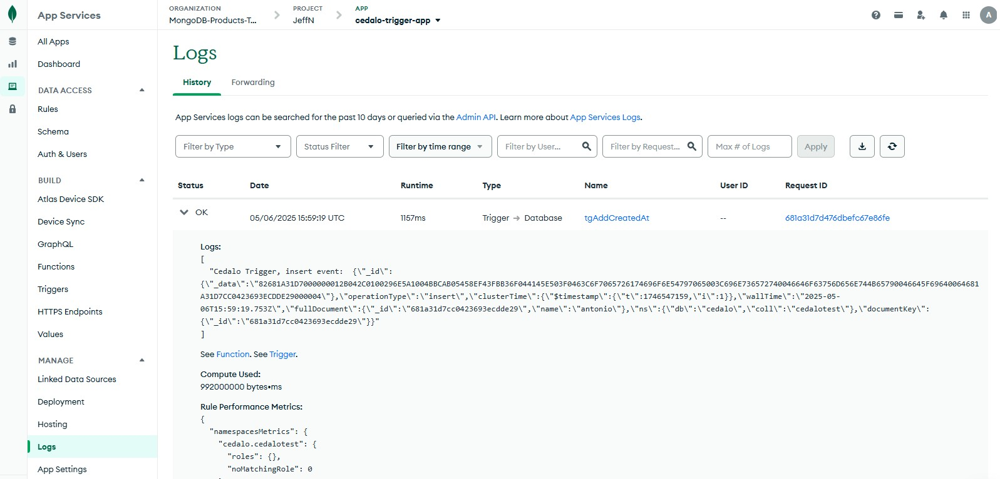
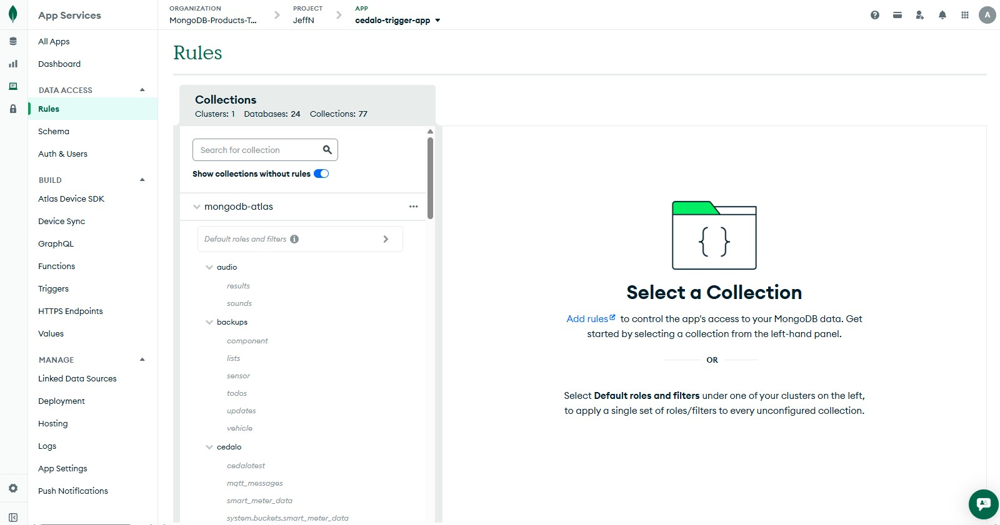

Select the function to be executed on a change event:

```js
exports = async function(changeEvent) {
  // Access the _id of the changed document:
  const docId = changeEvent.documentKey._id ? changeEvent.documentKey._id["$oid"] || changeEvent.documentKey._id : null;

  // Get the MongoDB service you want to use (see "Linked Data Sources" tab)
  const serviceName = "mongodb-atlas";
  const databaseName = "cedalo";
  const collectionName = changeEvent.ns.coll; // "cedalotest"; //
  const collection = context.services.get(serviceName).db(databaseName).collection(collectionName);
  const opsType = changeEvent.operationType;
  
  let result;
  let data;

  try {
    if (opsType === "insert") {
      const createdAt = new Date().toISOString();  
      console.log("Cedalo Trigger, insert event: ", JSON.stringify(changeEvent));  
  
      result = await collection.updateOne(  
        { _id: docId },  
        { $set: { created_at: createdAt } }  
      );  
    }
  } catch(err) {
    console.log("error performing mongodb write: ", err.message);
  }

  try {
    data =  await collection.find({ _id: docId });
  } catch(err) {
    console.log("error performing mongodb write: ", err.message);
  }

  const out = {
    req: {
      docId,
      opsType,
    },
    db: {
      serviceName, 
      databaseName, 
      collectionName,
    },
    data,
    result
  }
  
  return out;
};
```




