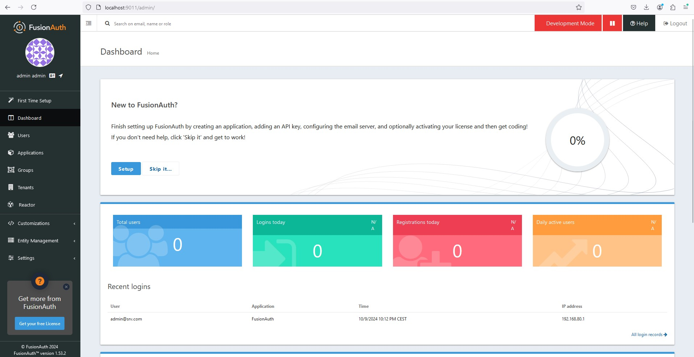

FusionAuth: Lightweight, open-source IAM with Docker support, easy to set up.
- Open-source IAM and SSO.
- Key Features: Multi-tenancy, customizable themes, OAuth, OpenID Connect, JWT support.
- [Download FusionAuth](https://fusionauth.io/download)
- [Fast Path Install For the 5-Minute Guide](https://fusionauth.io/docs/quickstarts/5-minute-fastpath)
- [Using FusionAuth on Docker](https://fusionauth.io/docs/get-started/download-and-install/docker)

## Setup
- [Setup Wizard](http://localhost:9011/admin/setup-wizard)