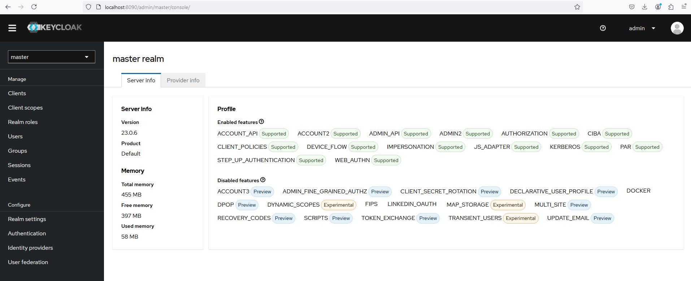

## Open Source Identity and Access Management
Keycloak being a widely used Identity and Access Management (IAM) system with Single Sign-On (SSO) capabilities, can also be configured to send logs to stdout when deployed in a containerized environment like Kubernetes.

### Centralized User Management
Keycloak allows you to centralize user management in one place, making it easier to manage users, roles, and permissions across multiple applications and services. It supports user federation, which means you can integrate it with existing user directories, such as LDAP or Active Directory.

### Single Sign-On (SSO) and Single Log-Out
One of the most significant features of Keycloak is its support for Single Sign-On (SSO). SSO enables users to log in once and gain access to multiple applications without being prompted to log in again at each of them. Similarly, Single Log-Out allows users to log out from all applications simultaneously.

### Social Login
Keycloak supports social login, allowing users to sign in using their social media accounts such as Google, Facebook, Twitter, etc. This feature enhances the user experience by simplifying the registration and login processes.

### Multi-factor Authentication (MFA)
For enhanced security, Keycloak supports Multi-factor Authentication (MFA). This adds an extra layer of security by requiring users to provide two or more verification factors to gain access to an application.

### OpenID Connect (OIDC) and SAML
Keycloak implements modern protocols like OpenID Connect (OIDC) and SAML 2.0 for authentication and authorization, making it versatile and compatible with a wide range of applications.

### API Access Management
Keycloak allows for securing application APIs by using tokens (JWT tokens or SAML assertions). It makes it easy to define which resources are secured and which roles or clients have access to them.

[](http://localhost:8090/admin/master/console/)

## Configuration
1. Logging Configuration for Keycloak in a Docker or Kubernetes Environment:
If you're running Keycloak using Docker or Kubernetes, it typically logs to stdout by default. However, you can explicitly configure it or ensure proper setup via environment variables in your deployment.

For Keycloak running on a WildFly server (its default application server), you can configure it to log to stdout by setting the following environment variables:

```yml
env:
- name: KEYCLOAK_LOGLEVEL
  value: INFO       # Sets the logging level (DEBUG, INFO, WARN, ERROR)
- name: WILDFLY_LOGGING_FILE
  value: stdout     # Sends logs to stdout
```

2. Helm Chart Configuration (Kubernetes Example):
If you're using Helm to deploy Keycloak, modify the values.yaml to ensure the logging is properly set:

```yml
extraEnv:
  - name: KEYCLOAK_LOGLEVEL
    value: INFO
  - name: WILDFLY_LOGGING_FILE
    value: stdout
```

This ensures that Keycloak outputs logs to stdout, making it compatible with Kubernetes' logging mechanisms.

For a self-hosted environment, [Keycloak](./README.md), [Gluu](../gluu.federation/README.md), or [FusionAuth](../fusion.auth/README.md) would be ideal choices, with Docker images readily available. If you want full control and customization, Keycloak remains one of the most versatile options with robust community support.

## References
- [Configuring Keycloak for production](https://www.keycloak.org/server/configuration-production)
- Client registration
  - [Client registration service](https://www.keycloak.org/securing-apps/client-registration)
  - [Client registration CLI](https://www.keycloak.org/securing-apps/client-registration-cli)
- [Running Keycloak in a container](https://www.keycloak.org/server/containers)
- [Keycloak Node.js adapter](https://www.keycloak.org/securing-apps/nodejs-adapter)
- [Docker Compose Deployments for Keycloak and PostgreSQL](https://medium.com/@disa2aka/docker-deployments-for-keycloak-and-postgresql-e75707b155e5)
- [Configure Multi-factor Authentication (MFA) for a Keycloak User](https://help.zerto.com/bundle/Linux.ZVM.HTML/page/Keycloak_defining_MFA.htm)
- [Configure User Federation: Keycloak with Microsoft Active Directory](https://help.zerto.com/bundle/Linux.ZVM.HTML/page/User_Federation.htm)